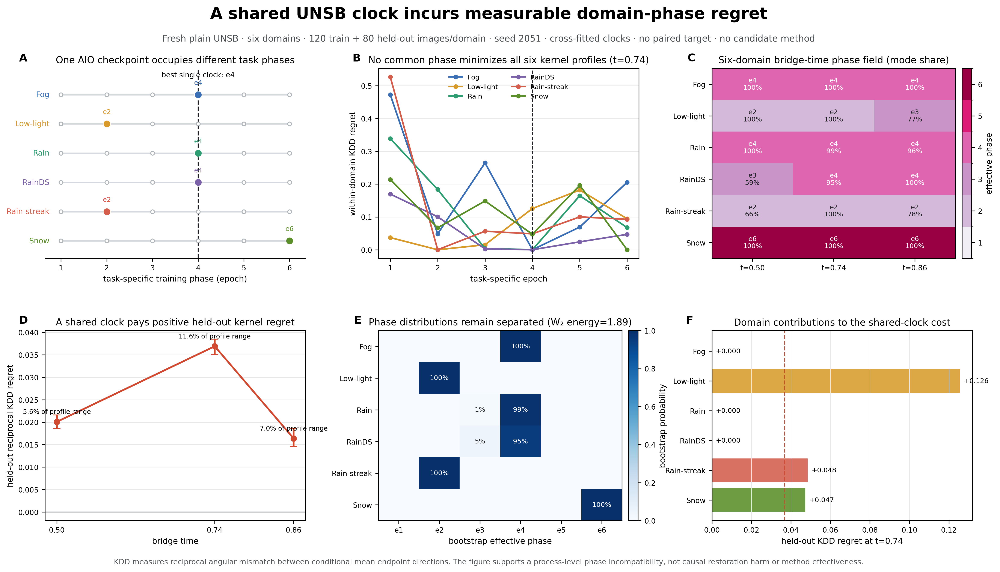

# MOT-001 阅读指南：从 Single/AIO 观测到六域共享时钟遗憾

> 更新：2026-08-26  
> 适用对象：第一次接触项目的研究者、准备续写论文的人，以及需要在新环境中继续与 Codex 讨论的人。  
> 本文是导航与解释，不替代冻结实验、机器可读证据或最新科学裁决。

## 1. 先记住四句话

1. 我们比较的是**同一个 plain UNSB** 在 Single-task 和 All-in-One 两种训练制度下的过程几何，不是先拿候选算法涨分再反推动机。
2. 当前稳定现象是：共享训练会改变条件恢复路径几何，而且差异依赖训练阶段、天气域和训练 seed。
3. 六域扩大实验把这个现象进一步表达为**共享时钟遗憾**：同一个 AIO checkpoint 无法同时处在六个域各自最合适的任务相位。
4. 这仍是观察性过程证据；它没有证明最终恢复质量受到因果损害，也没有证明 DT、HJ、HNEK 或任何新方法已经解决该问题。

全项目的最高优先级状态入口是 [decisions/CURRENT.md](../../../decisions/CURRENT.md)。若本文与其未来版本冲突，以后者及机器可读 evidence 为准。

## 2. 五分钟阅读顺序

1. 看下面这张六域头图，先获得直觉。
2. 读本文第 3–7 节，理解问题、实验和数学量。
3. 读[六域完整中文报告](../../../experiments/L2-medium-4090/EXP-L2-MOTIVATION-SIXDOMAIN-20260824/source_snapshot/final_delivery/reports/UNSB_SIXDOMAIN_PHASE_FINAL_CN.md)，核对数字和边界。
4. 读[固定窗口终局投票](../../../experiments/L1-local/EXP-L1-MOTIVATION-WINDOW-20260824/evidence/WINDOW_FINAL_VOTE_CN.md)，理解哪些早期解释已经被推翻。
5. 读 [CLAIM_LEDGER.json](./CLAIM_LEDGER.json) 和[当前总裁决](../../../decisions/CURRENT.md)，再讨论算法或论文表述。



可下载版本：[PNG](../../../outputs/figures/MOT-001_SIXDOMAIN_PHASE_HEADFIGURE.png) · [PDF](../../../outputs/figures/MOT-001_SIXDOMAIN_PHASE_HEADFIGURE.pdf) · [SVG](../../../outputs/figures/MOT-001_SIXDOMAIN_PHASE_HEADFIGURE.svg)

## 3. 研究问题到底是什么

设六个天气任务分别训练自己的 plain UNSB，得到六条 task-specific 条件路径轨迹；再把相同数据制度合并，训练一个共享的 plain AIO UNSB。我们问：

> 参数共享和多域交替更新之后，AIO 模型诱导的条件转移方向，是否还能被解释为所有域共同沿着同一训练时钟推进？

这个问题位于“为什么要改造 AIO UNSB”之前：

```text
Single-task plain UNSB
        ↓  与同架构 AIO plain UNSB 对照
观测共享训练造成的过程几何变化
        ↓  提炼可复算统计量
形成候选算法应该解释或降低的对象
        ↓  另行验证方法是否真的改善该对象和恢复质量
```

因此，头图中不应混入 DT/HJ 等候选方法；候选算法只能在后续独立实验中接受检验。

## 4. 两条证据链如何衔接

### 4.1 五域多 seed：建立现象并推翻固定窗口

早期主线使用 Fog、Low-light、Rain、Rain-streak、Snow 五域，围绕方向分散量 `U / U_reg` 比较 Single 与 AIO。

从 seed 2026 到 2031 的最终结论是：

- Epoch 1 的 AIO 方向发散在 6/6 seeds 上同号；
- Single/AIO 条件方向几何确实不同；
- 差异会随阶段、域和 seed 改变，甚至发生符号反转；
- “Epoch 4–5 存在普适过度压缩窗口”不能复现，已经关闭；
- `U / U_reg` 只能称为方向分歧或空间方向分散，不能称为真实后验协方差或校准不确定性。

这条证据链解决的是“现象是否存在以及哪些简单解释不成立”。

### 4.2 六域扩大实验：把现象升级为相位统计

六域实验恢复 RainDS-syn，并重新建立均衡数据制度：

- 每域 120 trainA、120 unpaired trainB；
- 每域 80 held-out A，共 480 张观测图；
- 六个 Single 各训练 6 epoch；
- 六域 AIO 训练 1 epoch；
- Single e1 与 AIO e1 的本域期望曝光相同；Single e6 与 AIO e1 的总更新步数相同；
- 不用配对关系训练，不读取 paired target 挑选现象。

RainDS-syn 只有 200 个输入身份，因此 120 trainA + 80 held-outA 是六域均衡规模的自然上限。此前的五域不是因为 RainDS 被科学否决，而是当时冻结了一个不与更早六域材料混用的五域子协议。

六域实验使用新训练 seed 2051。它扩大了域覆盖和图像级精度，但仍不是多训练 seed 确认。

## 5. 数学对象

### 5.1 条件核方向轨迹

记 AIO e1 在域 `d`、bridge time `t` 上，与该域 Single 第 `e` 个 epoch 的互易条件方向错配为

\[
\Gamma_{d,t}(e)
=\frac12\left[
\delta\!\left(\mu_A(X_A),\mu_{S,e}(X_A)\right)
+\delta\!\left(\mu_A(X_{S,e}),\mu_{S,e}(X_{S,e})\right)
\right],
\]

其中 \(\delta(u,v)=1-\cos(u,v)\)，\(\mu\) 是由 `M=32` 个随机 endpoint direction 得到的单位化平均方向。

它直接落在 UNSB 模型诱导的 bridge state 与 endpoint transition direction 上，但只比较条件平均方向，不是完整转移核之间的严格概率距离。

域–时有效相位定义为

\[
\phi_{d,t}=\arg\min_e\Gamma_{d,t}(e).
\]

### 5.2 共享时钟遗憾

如果强迫全部域共用训练相位 \(c\)，额外错配为

\[
G_t(c)=\frac1D\sum_d
\left[\Gamma_{d,t}(c)-\min_e\Gamma_{d,t}(e)\right].
\]

最佳共享时钟仍无法消除的代价是

\[
G_t^*=\min_c G_t(c).
\]

每域 80 张 held-out 图像预先分为 40/40 两折：一折选择公共/域专用时钟，另一折评价，再交换平均。bootstrap 时训练折和评价折分别重采样并重新拟合时钟，避免“在同一批样本上挑谷底又评价谷底”。

若局部近似

\[
\Gamma_{d,t}(c)-\Gamma_{d,t}(\phi_{d,t})
\approx \frac12h_{d,t}(c-\phi_{d,t})^2,
\]

则

\[
G_t^*\approx\frac1{2D}\sum_d h_{d,t}(\phi_{d,t}-c_t^*)^2.
\]

所以 \(G_t^*\) 可以理解为**条件核轨迹曲率加权的跨域相位离散能量**。平坦谷底不会因为 argmin 偶然差一格而被夸大；尖锐且错位的域才产生显著代价。

### 5.3 相位分布与 phase shear

对图像 bootstrap 后反复求相位，得到每个域–时单元的相位分布 \(\Pi_{d,t}\)。其 Wasserstein barycenter energy

\[
E_W(t)=\frac1D\sum_dW_2^2(\Pi_{d,t},\bar\Pi_t)
\]

衡量同一 bridge time 上完整相位分布的跨域分离；domain-time phase shear 则衡量不同域的相位差是否随 bridge time 发生不同变化。

## 6. 六域结果怎么读

同一个 AIO epoch-1 checkpoint 在三个 bridge time 上对应的六域相位为：

- `t=0.50`：`4 / 2 / 4 / 3 / 2 / 6`；
- `t=0.74`：`4 / 2 / 4 / 4 / 2 / 6`；
- `t=0.86`：`4 / 3 / 4 / 4 / 2 / 6`。

域顺序固定为 `Fog / Low-light / Rain / RainDS / Rain-streak / Snow`。

| bridge time | cross-fit \(G_t^*\) | 95% bootstrap | 占 profile range | \(E_W(t)\) |
|---:|---:|---:|---:|---:|
| 0.50 | 0.0201 | [0.0186, 0.0216] | 5.6% | 1.766 |
| 0.74 | 0.0369 | [0.0350, 0.0385] | 11.6% | 1.890 |
| 0.86 | 0.0164 | [0.0146, 0.0185] | 7.0% | 1.439 |

三个时刻的 5000 次 bootstrap 均为正；`M=16` 与 `M=32` 在 18 个域–时单元上的有效相位 18/18 一致。

### 图中六个面板

- **A**：同一 AIO checkpoint 映射到六个不同 task-specific phases；虚线是最佳公共相位。
- **B**：六个域的 \(\Gamma_{d,t}(e)\) 谷底并不重合；这是 A 面板的连续 profile 版本。
- **C**：三个 bridge time 上的六域相位场，并标出 bootstrap modal share。
- **D**：真正用于裁决的 cross-fitted shared-clock regret 及置信区间。
- **E**：相位 bootstrap 分布；它区分稳定错位与平坦谷底造成的不确定 argmin。
- **F**：在 `t=0.74` 上，各域对共享时钟代价的贡献。

## 7. 这张图允许和禁止表达什么

### 允许

> 在冻结的六域 plain UNSB 对照中，一个共享 AIO checkpoint 对应域依赖的有效任务相位；相对于域专用时钟，最佳公共时钟仍产生稳定为正的 held-out 条件方向错配。

> 该现象表明 All-in-One 参数共享伴随可测量的 domain–bridge-time path-geometry desynchronization。

### 禁止

- “AIO 必然降低最终恢复质量”；
- “共享时钟遗憾已经是因果 harm”；
- “KDD 等于完整 Schrödinger transition kernel 距离”；
- “图像 bootstrap 已证明跨训练 seed 稳定”；
- “DT/HJ/HNEK 已降低 \(G_t^*\)”；
- “存在固定 Epoch 4–5 过度压缩窗口”；
- “`U` 是校准预测不确定性或真实后验协方差”。

## 8. 它与算法工作的关系

这张图提供的是**候选算法的验收对象之一**，不是候选算法本身。一个与该动机真正呼应的方法至少需要预注册地回答：

1. 是否在未用于调参的 held-out 图像上降低 \(G_t^*\)、相位 Wasserstein 离散或 phase shear；
2. 是否同时改善或至少不损害恢复质量；
3. 改善是否超过通用正则化、普通路由或梯度手术对照；
4. 是否在多个训练 seed 和未触碰确认数据上保留。

截至 2026-08-26：DT/HJ 已在 clean deterministic 口径下关闭为当前主方法；HNEK 只是 development-frozen 候选；SEARCH-001 只通过工程门。不能用本动机图替这些候选补上尚未取得的效果证据。

## 9. 权威文件与证据地图

| 目的 | 权威入口 |
|---|---|
| 全项目当前状态 | [decisions/CURRENT.md](../../../decisions/CURRENT.md) |
| MOT-001 当前定义 | [README.md](./README.md)、[motivation.json](./motivation.json) |
| 六域实验身份 | [experiment.json](../../../experiments/L2-medium-4090/EXP-L2-MOTIVATION-SIXDOMAIN-20260824/experiment.json) |
| 六域完整解释 | [UNSB_SIXDOMAIN_PHASE_FINAL_CN.md](../../../experiments/L2-medium-4090/EXP-L2-MOTIVATION-SIXDOMAIN-20260824/source_snapshot/final_delivery/reports/UNSB_SIXDOMAIN_PHASE_FINAL_CN.md) |
| 六域机器裁决 | [PHASE_STATISTICS.json](../../../experiments/L2-medium-4090/EXP-L2-MOTIVATION-SIXDOMAIN-20260824/source_snapshot/final_delivery/reports/PHASE_STATISTICS.json) |
| 六域逐图原始统计 | [RECIPROCAL_KERNEL_BY_AGE.csv](../../../experiments/L2-medium-4090/EXP-L2-MOTIVATION-SIXDOMAIN-20260824/source_snapshot/final_delivery/raw/RECIPROCAL_KERNEL_BY_AGE.csv) |
| 六域冻结协议 | [SIXDOMAIN_PHASE_FROZEN_PROTOCOL.json](../../../experiments/L2-medium-4090/EXP-L2-MOTIVATION-SIXDOMAIN-20260824/source_snapshot/final_delivery/SIXDOMAIN_PHASE_FROZEN_PROTOCOL.json) |
| 固定窗口反证 | [WINDOW_FINAL_VOTE_CN.md](../../../experiments/L1-local/EXP-L1-MOTIVATION-WINDOW-20260824/evidence/WINDOW_FINAL_VOTE_CN.md) |
| 五域主张账本 | [CLAIM_LEDGER.json](./CLAIM_LEDGER.json) |

权威顺序是：机器可读原始裁决 → `decisions/CURRENT.md` → 最新冻结报告 → 模块 README/本文 → 历史叙事与计划。

## 10. 在新环境继续时怎么做

1. 克隆仓库并先阅读 `README.md`、`CURRENT_STATE_CN.md`、`decisions/CURRENT.md` 和本文。
2. 运行根目录要求的测试与编译；它们只验证基座契约，不代替 GPU 实验。
3. 将历史绝对路径视为 provenance，重新建立本机路径映射，不要创建同名空目录绕过身份检查。
4. 若只讨论动机，优先使用已上传的图、CSV、JSON 和冻结报告；大型 checkpoint 与原始数据并未进入 Git。
5. 若开发新方法，建立新的 candidate、frozen protocol 和 experiment ID，不原位覆盖 MOT-001 的冻结证据。

给新 Codex 的最短启动语可以是：

> 先阅读 `decisions/CURRENT.md` 与 `research/motivations/MOT-001-aio-path-geometry/READING_GUIDE_CN.md`，然后核对六域 `PHASE_STATISTICS.json`。请严格区分已支持的共享时钟遗憾、已否决的固定窗口、尚未证明的因果恢复损害，以及候选算法的独立效果状态。

